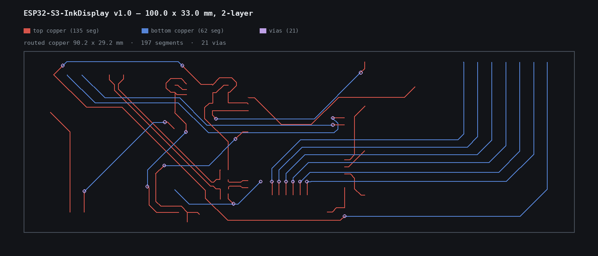
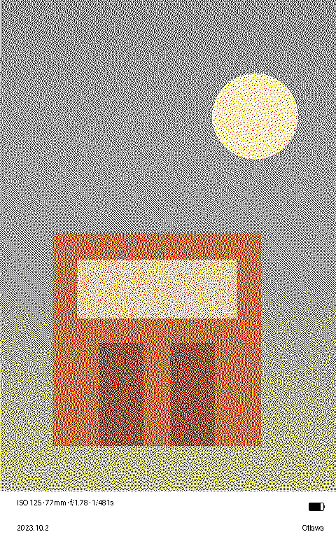
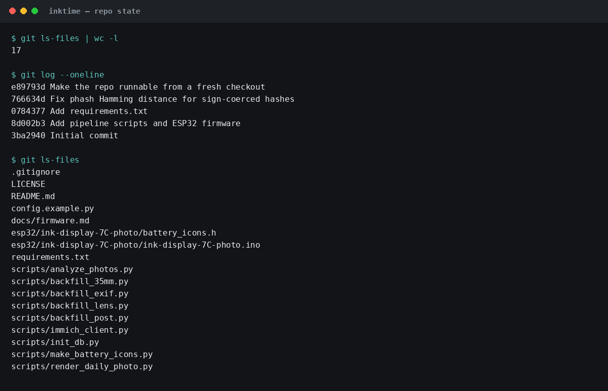

# InkTime

A 7.3" four-colour e-ink photo frame that shows a "today in history" photo every
morning. An ESP32-S3 wakes on a timer, pulls a pre-rendered 480x800 `.bin` frame
off a small HTTP host, paints it on a GDEM075F52 panel, overlays the live battery
level, and goes back to deep sleep.

The photos come from a self-hosted Immich library. A scoring pass picks the
photos that are actually worth showing, and a renderer composites the things you
actually want to see printed next to them: camera model, lens, exposure settings,
date and location.

```
Immich  ──►  analyze_photos.py  ──►  photos.db  ──►  render_daily_photo.py
(server)      VLM scoring pass       (SQLite)         compositing + dithering
                                                             │
                                                    photo_0..N.bin + previews
                                                             │
                                                             ▼
                                                 HTTP host ──► ESP32-S3 frame
```

## Gallery

**PCB** — ESP32-S3-InkDisplay v1.0, 100×33 mm, 2-layer. Red = top copper, blue = bottom, purple = vias.



**Rendered frame** — 480×800, 4-colour e-ink. Photo on top, specs + battery icon + date/location below.



**Repo** — 17 files, 5 commits on `main`.



## What is here

| Path | Role |
|---|---|
| `scripts/analyze_photos.py` | Pulls assets from Immich, scores them with a vision model, extracts EXIF, writes `photos.db` |
| `scripts/immich_client.py` | Immich REST client (ping, asset info, thumbnails, cache sync) |
| `scripts/render_daily_photo.py` | Selects today's photos, composites the info panel, dithers to 4 colours, writes `.bin` + previews |
| `scripts/init_db.py` | Creates a fresh `photos.db` with the full schema |
| `scripts/make_battery_icons.py` | Regenerates `battery_icons.h` (11 icons, 0-100%) |
| `scripts/backfill_*.py` | One-off repair passes over an existing database |
| `esp32/ink-display-7C-photo/` | Device firmware. Captive-portal Wi-Fi setup, download, battery overlay, deep sleep |
| `config.example.py` | Template for the untracked `config.py`; copy it to the repo root and edit |
| `docs/firmware.md` | Pinout, battery divider, `arduino-cli` build flags, calibration procedure |

## The frame

`esp32/ink-display-7C-photo/` is one sketch plus one generated header.

- Panel: GDEM075F52, 480x800, four colours (black / white / red / yellow).
- Board: ESP32-S3 N8R8 (8 MB OPI PSRAM, 16 MB flash).
- `battery_icons.h` holds eleven 24x24 icons, 1 byte per pixel, palette `0=black 1=white 2=red 3=yellow`.
  Index 1 is transparent: the firmware paints white underneath and skips it.
- Battery is read on a 1S LiPo through a 100k/100k divider into an ADC pin, with a
  calibration factor and an 11-step voltage table in the sketch.
- `DAILY_PHOTO_PATH_PREFIX` in the sketch **must match** the renderer's output
  directory on the server. It ships as `CHANGEME_32_HEX_DOWNLOAD_KEY`; change it
  before flashing, otherwise the URL your frame requests is guessable by anyone
  who can reach the host.

Build flags matter. `build.psram=opi` is not optional: without it the framebuffer
allocation fails and init spins. Full command and the calibration walkthrough are
in `docs/firmware.md`.

## Server setup

Requires Python 3.10+, `Pillow`, `pillow-heif`, `requests`, and `exiftool` on
`PATH` (used for GPS/EXIF on originals; the pipeline degrades gracefully without it).

```sh
python -m venv venv && . venv/bin/activate
pip install -r requirements.txt
cp config.example.py config.py   # then edit it
```

`config.py` is read by every script and is **not** tracked. `config.example.py`
documents every key; the ones you cannot skip:

- `IMMICH_URL`, `IMMICH_API_KEY` - your Immich server. The key needs
  `asset.read`, `asset.view`, `asset.download` and `asset.update`.
  `asset.view` is a separate scope; without it thumbnails 403 even for the owner.
- `DB_PATH` - SQLite file. Everything else hangs off it.
- `BIN_OUTPUT_DIR` - where `.bin` frames land. Serve this over HTTP at the path
  prefix compiled into the firmware.
- `API_CHANNELS` - vision-model endpoints. Each entry is
  `{"api_url": ..., "model": ..., "api_key": "env:VAR_NAME"}`. Listing more than
  one makes the pass fail over on 429 instead of stalling.
- `WORLD_CITIES_CSV` - a GeoNames-style CSV with `lat,lon,name_en,name_zh`
  columns, used for reverse geocoding. Not shipped: it is a few MB of upstream
  data. Without it the location line renders empty rather than wrong.

Then:

```sh
python scripts/init_db.py                 # once: create the database schema
python scripts/analyze_photos.py -j 1     # score + ingest. -j 1: SQLite deadlocks higher
python scripts/render_daily_photo.py      # today's frames -> BIN_OUTPUT_DIR
```

Both are designed to run from cron or a container scheduler. The analyzer is
idempotent per asset; the renderer marks what it used so the next run picks
different photos.

## Database

One SQLite file, one main table. `photo_scores` is keyed on `path`, with
`immich_asset_id` as the join key back to Immich, plus the EXIF columns the
renderer reads (`exif_datetime`, `exif_make`, `exif_model`, `exif_iso`,
`exif_exposure_time`, `exif_f_number`, `exif_focal_length`, `exif_lens`,
`exif_focal_35mm`, `exif_file_size`, `exif_gps_*`, `exif_city`), the scoring
columns (`memory_score`, `beauty_score`, `reason`), and bookkeeping (`phash`,
`used_at`, `people_json`).

Two notes for anyone adapting this:

- `ensure_table()` creates `photo_scores` and `face_allowlist`, and adds columns
  individually for forward migration. `photo_blacklist` and the newer EXIF
  columns (`exif_focal_35mm`, `exif_lens`, `exif_file_size`, `album`) were added
  by the backfill scripts on the original deployment and are not created by
  `ensure_table()` — so run `scripts/init_db.py` once against a fresh database
  (it is idempotent) or the renderer's LEFT JOIN fails on first run.
- `phash` is stored as an integer in a signed column. Perceptual hashes use the
  full 64-bit range and are compared with Hamming distance after masking; if you
  rewrite the dedupe path, keep the masking.

## Selection

A photo is eligible when it has a parseable EXIF blob, scores above
`MEMORY_THRESHOLD`, is not blacklisted, and was not used inside
`USED_COOLDOWN_DAYS`. Among the eligible set the renderer prefers the same
calendar day in past years; if nothing clears the bar it walks back a day at a
time, and finally falls back to the global maximum. `DAILY_PHOTO_QUANTITY`
frames are written per run and the frame picks one at random, so a day's frame is
not predictable from the last one.

Deduplication runs before scoring, not after: an 8x8 difference hash with a
strict distance for near-identical frames, plus a wider distance inside a short
time window to catch bursts. It costs a model call to score a photo, so throwing
out the near-duplicates first is the cheap order.

## Attribution

The 4-colour dithering and the info-panel layout follow the conventions of
Apple Photos' detail panel (camera, lens, exposure, date, place). Focal length is
shown as the **35mm equivalent**, read from EXIF tag `0xA405`, because that is the
number people recognise; the physical value is meaningless for phone photos.
Previews render a copy of the battery icon so the PNG matches the frame; the
`.bin` deliberately does not contain it, because the frame draws the live level.
